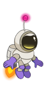

# **Global Game Jam 2020 / Limbs Away**

**Limbs Away** is the collab effort of Thanasis Capelonis (Programming), subamanis (Programming), alexandervrs (Art & Animation) for Global Game Jam 2020

You are an astronaut lost in space, suddenly your thruster malfunctions & you're blasted in pieces! but wait... you can still repair yourself, somewhat faithfully that is.

**Istallation**

You can download an [Android APK](https://mega.nz/#!qZU3FQqL!1Tly9bI58-Ruf-iFLedEIsSWKAGqfeS7Xx1QkGdGIhw) or clone and import the project in Unity

**Controls**

The game screen is split in 3 parts. Touch the left side and swipe up and down to accelerate. Touch the right side and swipe up and down to rotate and correct your direction. Touch the middle of the screen and swipe left or right to switch between all your missing limbs.

You have to bring all the pieces together! Try to beat the game in the quickest time possible!

**Music Credits**

Royalty-free music by Asobeat